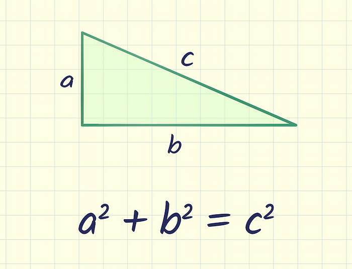
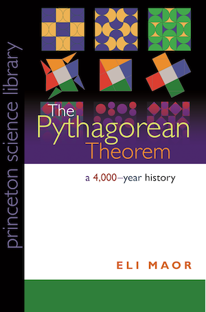

I've been interested lately in the Pythagorean theorem, and the myriad of ways one can prove it.

An excellent resource is the website [Cut The Knot](https://www.cut-the-knot.org/pythagoras/).

Another great source is John C. Sparks'  [The Pythagorean Theorem: Crown Jewel of Mathematics](http://wpafbstem.com/media/math_resources/pythagorean_theorem.pdf).

Finally, I would recommend Eli Maor's book, "The Pythagorean Theorem".

{fig-align="center"}

I used my tablet to write down my own version of some of the nicest proofs, [see here](pythagoras.pdf). 

