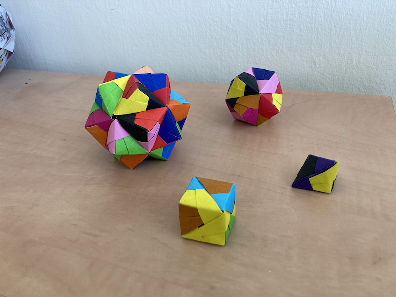
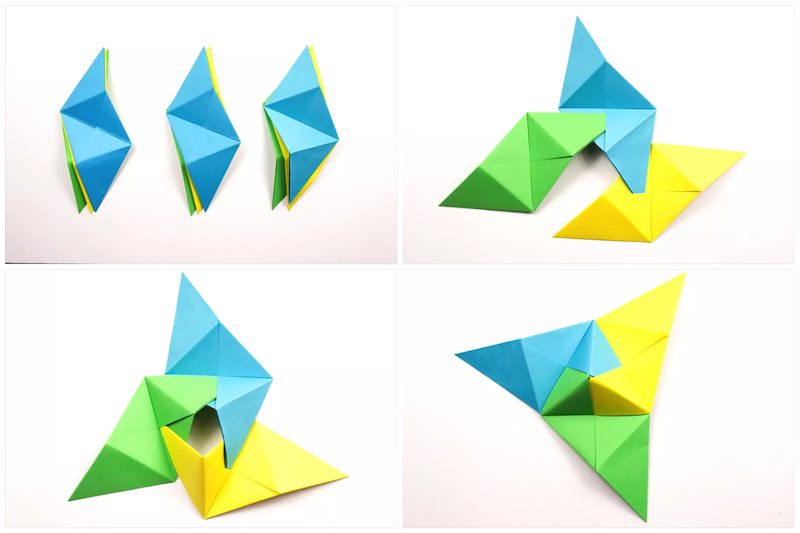
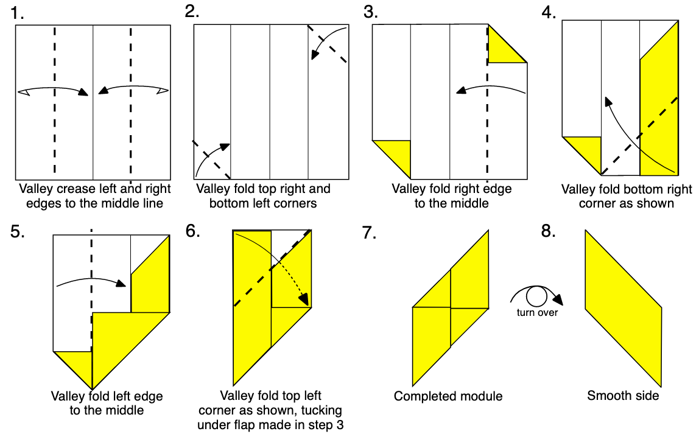
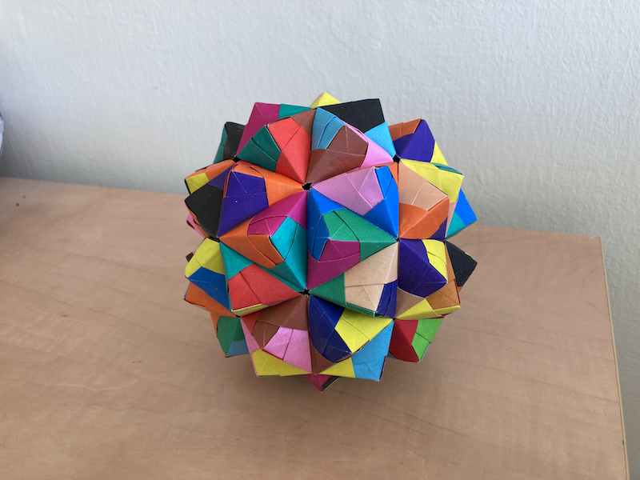

All these modular origami constructions are made of a single basic module, the Sonobe unit.

The basic unit has [flaps and pockets](https://www.thesprucecrafts.com/geometric-sonobe-unit-origami-art-4138606).

The actual folding of the Sonobe module is quite easy, see the instructions below, taken from [Michael Naughton's excellent diagram](https://www.amherst.edu/media/view/290032/original/oragami.pdf).

This is an incredibly flexible unit, allowing us to combine it in many ways.
[This pdf](http://www.origamee.net/diagrams/sonoassm.pdf) shows how to combine different numbers of Sonobe modules to produce the shapes above, and many others.
If all meeting points of the basic unit contain 3 modules, one gets a cube.
If all meeting points contain 4 modules, then we produce a octahedron (with pyramids on each of its faces).

The results can be very impressive! Above is a Truncated Icosahedron, made of pentagons surrounded by hexagons (like a soccer ball).
This one is made of 90 Sonobe units, see [detailed instructions](https://mathcraft.wonderhowto.com/how-to/modular-origami-make-truncated-icosahedron-pentakis-dodecahedron-more-0131528/).

