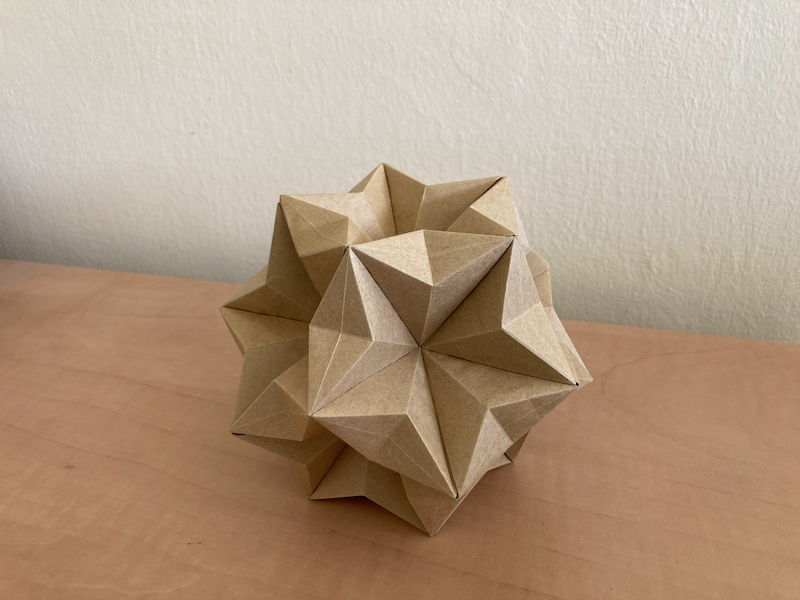
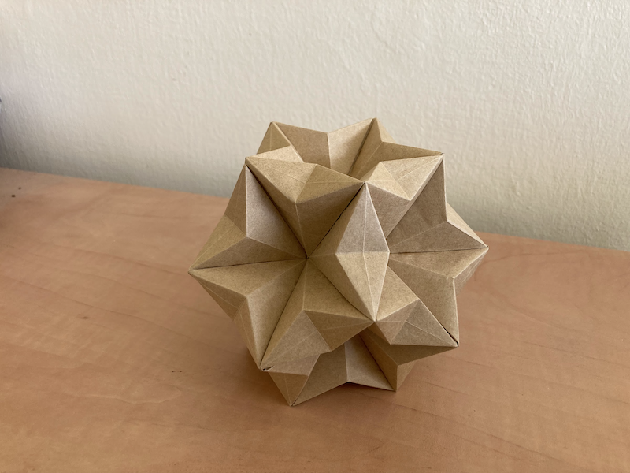

This structure has the general shape of a dodecahedron, with 12 beautiful pentagonal stars embeded in it.
I found a while back a scan of the book [Tomoko Fuse Unit Origami Fantasy](https://archive.org/details/TomokoFuseUnitOrigamiFantasyv2japanese/page/n73/mode/2up).
The book is all written in japanese, but I could make sense of the diagrams.

Tomoko Fuse is a master of modular origami, just google her name and you'll find tons of fun projects.

I used craft paper to give the structure a muted tones and a rustic feel.
I think it turned out pretty good 😊.

