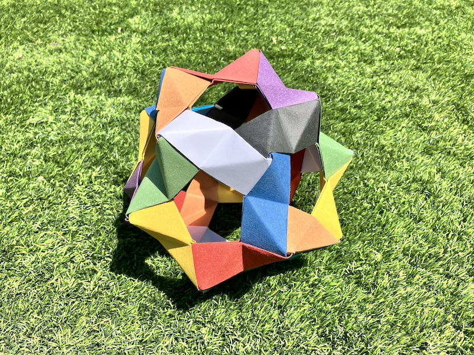
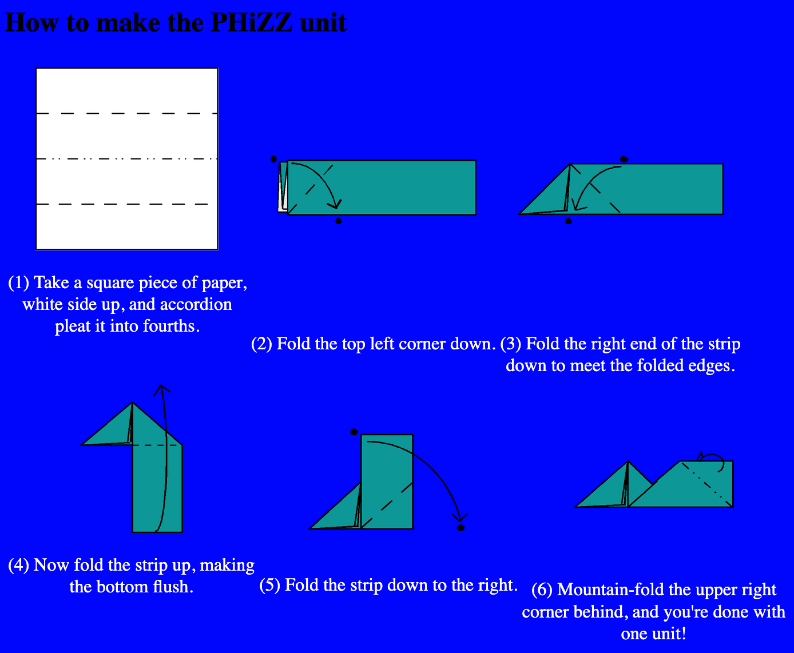
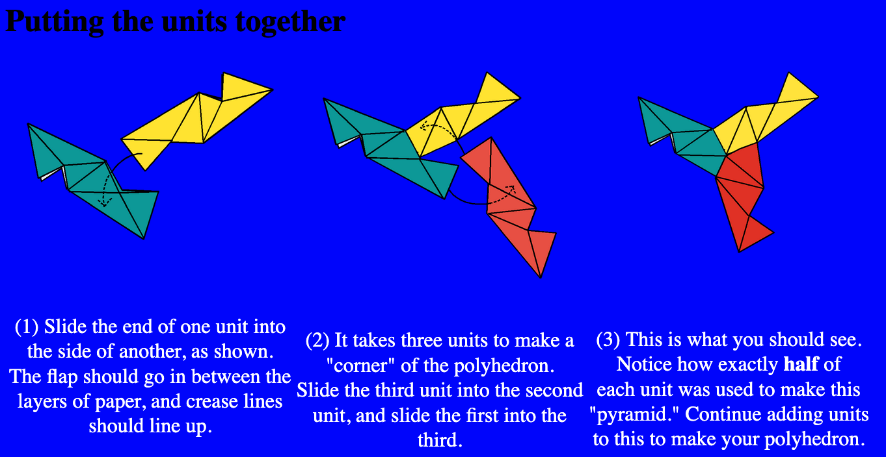
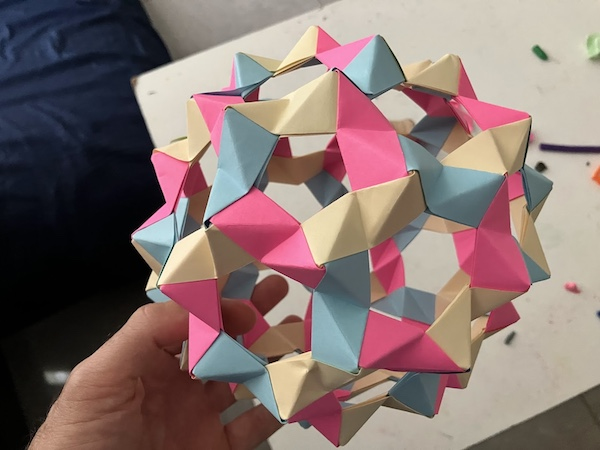

The PHiZZ module is probably the easiest modular origami unit to fold, and it is also very versatile. PHiZZ stands for pentagon-hexagon zig-zag unit, because you can make a shape made of pentagons and hexagons.

The shape below is make of 12 pentagons.

From the excellent [origametry.net](http://origametry.net/phzig/phzig.html), we learn how to fold the PHiZZ unit.

To put the units together, follow this:

It is nice to build shapes out of 3 colors, which means that we can construct a [Hamiltonian path](https://en.wikipedia.org/wiki/Hamiltonian_path) through the shape, which is a path that visits each vertex exactly once. See the "football" below (12 pentagons, each surrounded by 5 hexagons). If you choose one color to ignore, you can think of the hamiltonian path as the one that is made of the other two colors.

Extra links:

* [Notes on Spherical Buckyballs -- Part 1](http://origametry.net/combgeom/bucky/buckynotes.html)
* [Notes on Spherical Buckyballs -- Part 2](http://origametry.net/combgeom/bucky/buckynotes2.html)
* [Large Phizz Buckyball](https://kazza.id.au/2011/04/large-phizz-buckyball.html)
