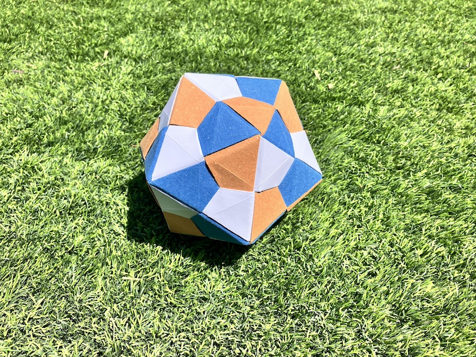
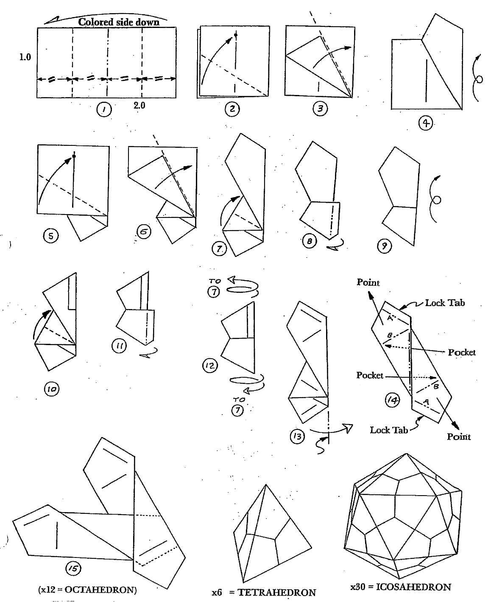
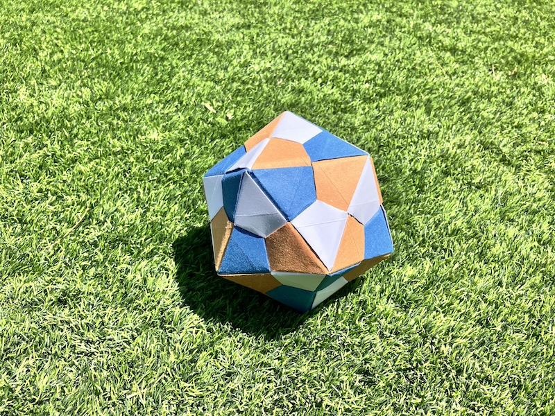

With this module you can make only one shape, a dodecahedron. It is surprising how sturdy it is, you have to hold it to understand. This module was invented by Lewis Simon and Bennett Arnstein. Differently from the common square-based modules, this one is based on a 2x1 rectangle.

Full instructions how to fold: [here](https://www.mathdept.okstate.edu/mathclub/Minutes/origami_models.pdf)

If you prefer a video, see below.

<iframe width="560" height="315" src="https://www.youtube.com/embed/H7qE_Tc8e4g?si=guUTD6F_s-UjRIXg" title="YouTube video player" frameborder="0" allow="accelerometer; autoplay; clipboard-write; encrypted-media; gyroscope; picture-in-picture; web-share" referrerpolicy="strict-origin-when-cross-origin" allowfullscreen></iframe>

