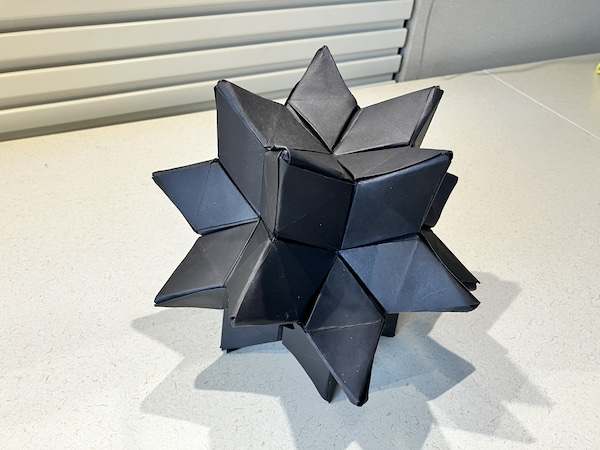
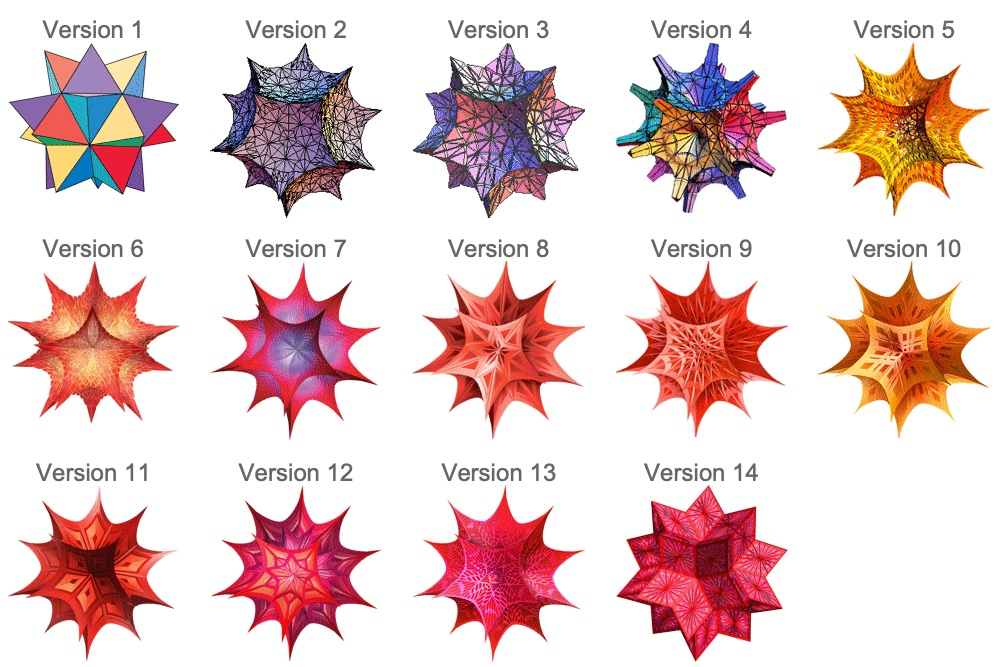

They call it online the Celestial Kusudama.

These are the instructions to Joseph Hwang's design.

<iframe width="560" height="315" src="https://www.youtube.com/embed/-uS6vLjXTOk?si=i1SZtZGtZXsV3fPA" title="YouTube video player" frameborder="0" allow="accelerometer; autoplay; clipboard-write; encrypted-media; gyroscope; picture-in-picture; web-share" referrerpolicy="strict-origin-when-cross-origin" allowfullscreen></iframe>

In geometry, this is the Rhombic hexecontahedron, one of the setllations of the Rhombic triacontahedron.

This is the same shape as Wolfram Mathematica's logo.
