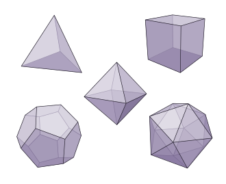
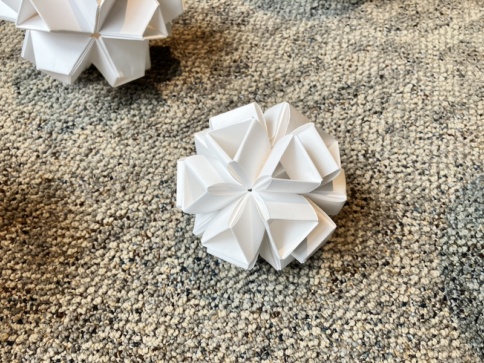
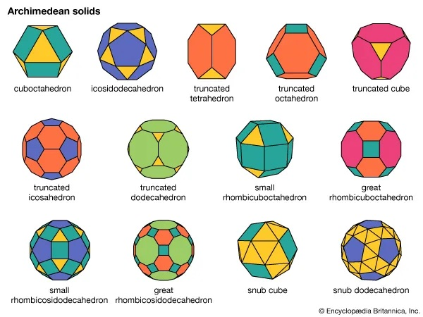
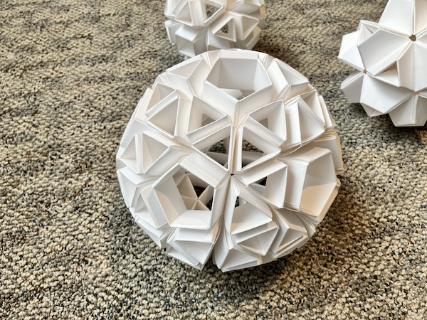
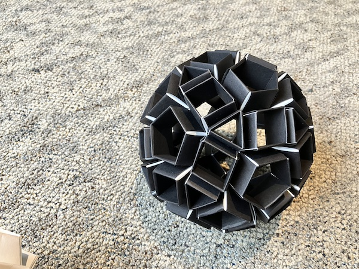
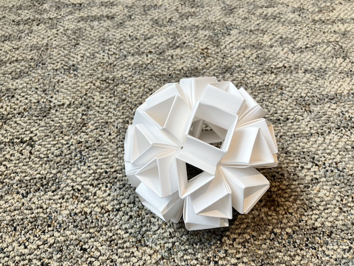
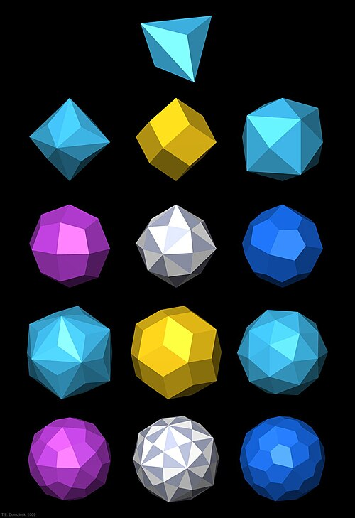
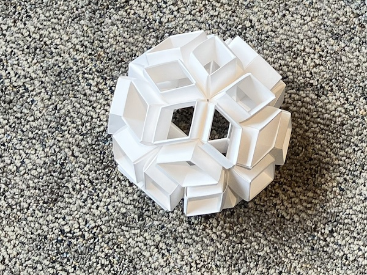

This technique is quite easy to master, and gives you infinite options.

Read these pages from Faye E. Goldman's book, [Geometric Origami](https://research.ecomakery.com/geometric-origami/).

There are lots of tutorials on youtube, look them up :)

I found this tutorial useful:

<iframe width="560" height="315" src="https://www.youtube.com/embed/o2L3VRztmh8?si=tNEM0ZRwvCkr1IWp" title="YouTube video player" frameborder="0" allow="accelerometer; autoplay; clipboard-write; encrypted-media; gyroscope; picture-in-picture; web-share" referrerpolicy="strict-origin-when-cross-origin" allowfullscreen></iframe>

What I like most about Snapology is that you can construct many kinds of solids:

## Platonic solids

An icosahedron.

## Archimedean solids

A snub dodecahedron.  

A rhombicosidodecahedron.  

A snub cube.  

## Catalan solids

These are the duals of the Archimedean solids.

A rhombic triacontahedron.
