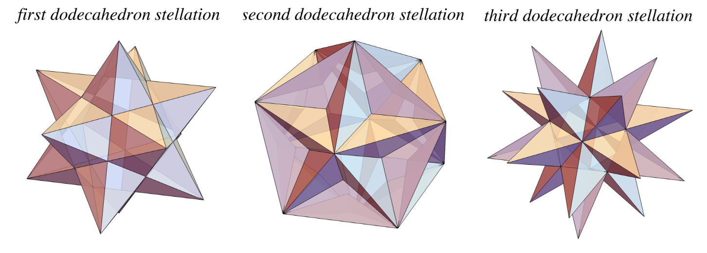
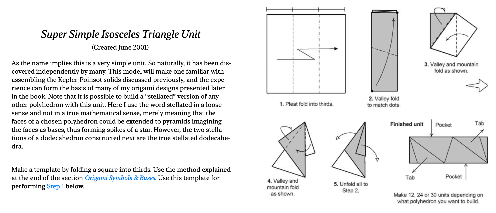
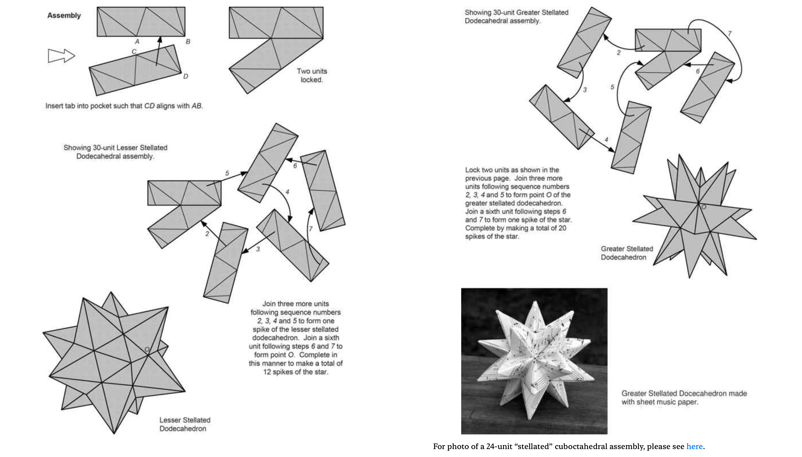

These instructions are from the book “Exquisite Modular Origami” by Meenakshi Mukerji (pages 24-27 in this [link]((https://fliphtml5.com/lacvi/ewwn/basic))).

Pages 24-25:

Pages 26-27:

If you prefer a video, see below.

<iframe width="560" height="315" src="https://www.youtube.com/embed/3ZbtZU2NCtE?si=jpF_hTKUTMkykeGW" title="YouTube video player" frameborder="0" allow="accelerometer; autoplay; clipboard-write; encrypted-media; gyroscope; picture-in-picture; web-share" referrerpolicy="strict-origin-when-cross-origin" allowfullscreen></iframe>

The small and great stellated dodecahedra are two of the four [Kepler-Poinsot solids](https://en.wikipedia.org/wiki/Kepler%E2%80%93Poinsot_polyhedron).

Image source: [Wolfram Mathworld](https://mathworld.wolfram.com/DodecahedronStellations.html)

See the video below to see the beautiful symmetry of these shapes, and how they relate to the dodecahedron.

<iframe width="560" height="315" src="https://www.youtube.com/embed/rDCWkJnBKnY?si=37-s5f2oUFokEfdF" title="YouTube video player" frameborder="0" allow="accelerometer; autoplay; clipboard-write; encrypted-media; gyroscope; picture-in-picture; web-share" referrerpolicy="strict-origin-when-cross-origin" allowfullscreen></iframe>